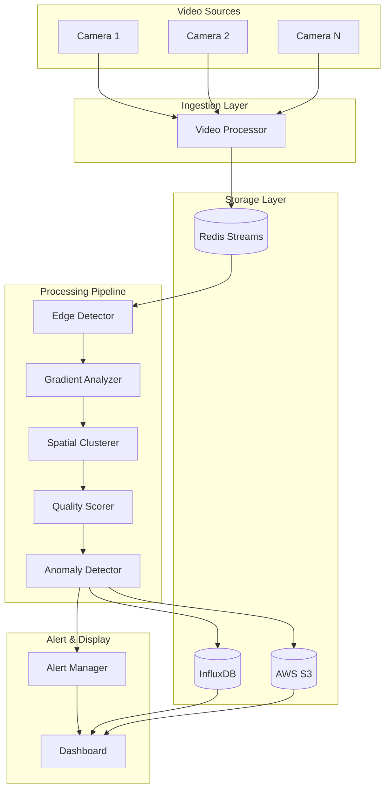
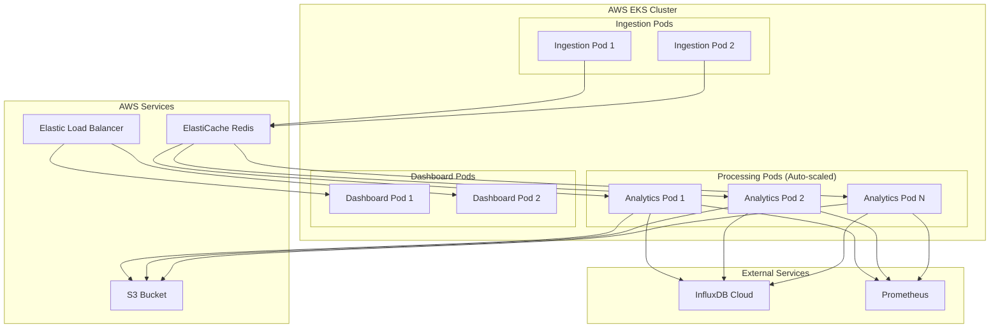

# Design Document: Workshop Safety Edge Analytics Engine

## Overview

The Workshop Safety Edge Analytics Engine is a distributed, real-time computer vision system built on Node.js that monitors workshop machines through video feeds to detect safety anomalies. The system employs a pipeline architecture where video frames flow through multiple processing stages: capture, edge detection, gradient analysis, spatial clustering, quality scoring, and anomaly detection. The system is designed for horizontal scalability on AWS EKS and provides real-time feedback through a web dashboard.

### Key Design Principles

1. **Pipeline Architecture**: Sequential processing stages with clear interfaces
2. **Stateless Processing**: Each frame processed independently for horizontal scalability
3. **Baseline Tracking**: Statistical baselines maintained per camera for anomaly detection
4. **Real-time Performance**: Sub-500ms end-to-end latency requirement
5. **Fault Tolerance**: Graceful degradation and automatic recovery

### Technology Stack

- **Runtime**: Node.js (v18+)
- **Computer Vision**: OpenCV.js (JavaScript bindings for OpenCV)
- **Container Orchestration**: AWS EKS (Kubernetes)
- **Time-Series Database**: InfluxDB for metrics storage
- **Object Storage**: AWS S3 for frame snapshots
- **Message Queue**: Redis Streams for frame distribution
- **Dashboard**: React with WebSocket for real-time updates
- **Monitoring**: Prometheus + Grafana

## Architecture

### System Architecture Diagram



### Deployment Architecture



## Components and Interfaces

### 1. Video Processor

**Responsibility**: Capture video frames from camera feeds and perform preprocessing.

**Interface**:
```typescript
interface VideoProcessor {
  // Connect to a camera feed
  connectCamera(cameraId: string, streamUrl: string): Promise<void>;
  
  // Disconnect from a camera feed
  disconnectCamera(cameraId: string): Promise<void>;
  
  // Get current status of all cameras
  getCameraStatus(): CameraStatus[];
  
  // Event emitted when a frame is captured and preprocessed
  on(event: 'frame', callback: (frame: ProcessedFrame) => void): void;
}

interface ProcessedFrame {
  cameraId: string;
  timestamp: number;
  frameNumber: number;
  imageData: Buffer;  // Preprocessed image data
  width: number;
  height: number;
  metadata: {
    originalBrightness: number;
    contrastAdjustment: number;
  };
}

interface CameraStatus {
  cameraId: string;
  connected: boolean;
  fps: number;
  lastFrameTimestamp: number;
}
```

**Implementation Details**:
- Uses OpenCV's VideoCapture for frame acquisition
- Applies histogram equalization for lighting normalization
- Maintains a circular buffer (30 seconds) per camera using a ring buffer data structure
- Publishes frames to Redis Streams with camera ID as the stream key
- Implements exponential backoff for reconnection attempts (5s, 10s, 20s, max 60s)

### 2. Edge Detector

**Responsibility**: Perform multi-scale Canny edge detection on preprocessed frames.

**Interface**:
```typescript
interface EdgeDetector {
  // Detect edges at multiple scales
  detectEdges(frame: ProcessedFrame): Promise<EdgeMaps>;
  
  // Update detection parameters
  updateParameters(params: EdgeDetectionParams): void;
}

interface EdgeMaps {
  cameraId: string;
  timestamp: number;
  scales: {
    fine: EdgeMap;
    medium: EdgeMap;
    coarse: EdgeMap;
  };
}

interface EdgeMap {
  imageData: Buffer;  // Binary edge map
  width: number;
  height: number;
  edgeCount: number;
  scale: number;  // Gaussian blur sigma value
}

interface EdgeDetectionParams {
  fineScale: number;      // Default: 1.0
  mediumScale: number;    // Default: 2.0
  coarseScale: number;    // Default: 4.0
  lowThresholdRatio: number;   // Default: 0.5
  highThresholdRatio: number;  // Default: 1.5
}
```

**Implementation Details**:
- Applies Gaussian blur at three sigma values (1.0, 2.0, 4.0) for multi-scale analysis
- Uses Otsu's method to calculate adaptive thresholds from frame histogram
- Low threshold = median * lowThresholdRatio
- High threshold = median * highThresholdRatio
- Uses OpenCV's Canny function with hysteresis thresholding
- Preserves edge connectivity using connected components analysis

### 3. Gradient Analyzer

**Responsibility**: Compute Sobel gradients and analyze edge characteristics.

**Interface**:
```typescript
interface GradientAnalyzer {
  // Analyze gradients from edge maps
  analyzeGradients(edgeMaps: EdgeMaps): Promise<GradientData>;
}

interface GradientData {
  cameraId: string;
  timestamp: number;
  scales: {
    fine: ScaleGradientData;
    medium: ScaleGradientData;
    coarse: ScaleGradientData;
  };
}

interface ScaleGradientData {
  magnitudeMap: Float32Array;  // Normalized gradient magnitudes
  orientationHistogram: number[];  // 8-bin histogram (0-360 degrees)
  meanMagnitude: number;
  maxMagnitude: number;
  edgePixels: EdgePixel[];  // Pixels above noise threshold
}

interface EdgePixel {
  x: number;
  y: number;
  magnitude: number;
  orientation: number;  // Radians
}
```

**Implementation Details**:
- Applies Sobel operators (3x3 kernels) in X and Y directions
- Computes magnitude: sqrt(Gx² + Gy²)
- Computes orientation: atan2(Gy, Gx)
- Normalizes magnitudes to [0, 1] range using min-max normalization
- Filters out pixels with magnitude < 0.1 (noise threshold)
- Bins orientations into 8 bins (45-degree increments) for histogram

### 4. Spatial Clusterer

**Responsibility**: Cluster edge points using spatial hashing to identify localized anomalies.

**Interface**:
```typescript
interface SpatialClusterer {
  // Cluster edge points from gradient data
  clusterEdges(gradientData: GradientData, baseline: BaselineStats): Promise<ClusterData>;
  
  // Update baseline statistics
  updateBaseline(cameraId: string, gradientData: GradientData): void;
}

interface ClusterData {
  cameraId: string;
  timestamp: number;
  clusters: Cluster[];
  totalEdgePoints: number;
}

interface Cluster {
  id: string;
  centroid: { x: number; y: number };
  boundingBox: { x: number; y: number; width: number; height: number };
  pointCount: number;
  meanMagnitude: number;
  dominantOrientation: number;
  anomalyScore: number;  // 0-1 based on deviation from baseline
}

interface BaselineStats {
  cameraId: string;
  meanEdgeDensity: number;
  stdEdgeDensity: number;
  meanClusterSize: number;
  stdClusterSize: number;
  frameCount: number;
}
```

**Implementation Details**:
- Uses spatial hash grid with configurable cell size (default: 20x20 pixels)
- Hash function: `hash(x, y) = (x / cellSize) + (y / cellSize) * gridWidth`
- Identifies high-density cells: density > (mean + 2 * std)
- Merges adjacent high-density cells using union-find algorithm
- Computes cluster statistics (centroid, bounding box, mean magnitude)
- Maintains baseline using sliding window of 100 frames
- Updates baseline with exponential moving average: `new = 0.99 * old + 0.01 * current`

### 5. Quality Scorer

**Responsibility**: Calculate quantitative edge quality metrics.

**Interface**:
```typescript
interface QualityScorer {
  // Calculate quality metrics from gradient and cluster data
  scoreQuality(gradientData: GradientData, clusterData: ClusterData): Promise<QualityMetrics>;
}

interface QualityMetrics {
  cameraId: string;
  timestamp: number;
  density: number;        // 0-100 scale
  sharpness: number;      // 0-100 scale
  orientationBalance: number;  // 0-100 scale
  rawMetrics: {
    edgeDensity: number;      // Raw ratio
    meanMagnitude: number;    // Raw mean
    orientationEntropy: number;  // Raw entropy
  };
}
```

**Implementation Details**:
- **Edge Density**: `edgePixels / totalPixels`
  - Normalized to 0-100 using typical range [0.01, 0.20]
- **Edge Sharpness**: Mean gradient magnitude across all edge pixels
  - Normalized to 0-100 using typical range [0.2, 0.8]
- **Orientation Balance**: Shannon entropy of orientation histogram
  - Formula: `-Σ(p_i * log2(p_i))` where p_i is probability of bin i
  - Maximum entropy (perfect balance) = log2(8) = 3.0
  - Normalized to 0-100: `(entropy / 3.0) * 100`

### 6. Anomaly Detector

**Responsibility**: Detect anomalies based on quality metrics and cluster patterns.

**Interface**:
```typescript
interface AnomalyDetector {
  // Detect anomalies from quality metrics and clusters
  detectAnomalies(
    qualityMetrics: QualityMetrics,
    clusterData: ClusterData,
    baseline: BaselineStats
  ): Promise<AnomalyResult>;
  
  // Get current baseline for a camera
  getBaseline(cameraId: string): BaselineStats;
  
  // Reset baseline for a camera
  resetBaseline(cameraId: string): void;
}

interface AnomalyResult {
  cameraId: string;
  timestamp: number;
  hasAnomaly: boolean;
  anomalies: Anomaly[];
  overallSeverity: number;  // 0-100
}

interface Anomaly {
  type: 'metric_deviation' | 'cluster_size' | 'cluster_pattern';
  severity: number;  // 0-100
  description: string;
  affectedRegion?: { x: number; y: number; width: number; height: number };
  metrics?: {
    metricName: string;
    currentValue: number;
    baselineValue: number;
    deviationStdDevs: number;
  };
}
```

**Implementation Details**:
- **Metric Deviation Detection**:
  - Calculate z-score: `(current - mean) / std`
  - Flag if |z-score| > 3.0
  - Severity: `min(100, |z-score| * 20)`
- **Cluster Size Detection**:
  - Flag clusters with pointCount > 500
  - Severity: `min(100, (pointCount / 500) * 50)`
- **Baseline Management**:
  - Separate baseline per camera stored in Redis
  - Update every frame using exponential moving average
  - Full baseline recalculation every 1000 frames
- **Overall Severity**: Maximum severity among all detected anomalies

### 7. Alert Manager

**Responsibility**: Generate, deduplicate, and dispatch alerts.

**Interface**:
```typescript
interface AlertManager {
  // Process anomaly result and generate alerts
  processAnomaly(anomalyResult: AnomalyResult, frameSnapshot: Buffer): Promise<void>;
  
  // Get recent alerts
  getAlerts(filter: AlertFilter): Promise<Alert[]>;
  
  // Acknowledge an alert
  acknowledgeAlert(alertId: string, userId: string): Promise<void>;
}

interface Alert {
  id: string;
  cameraId: string;
  timestamp: number;
  priority: 'high' | 'medium' | 'low';
  severity: number;
  anomalyType: string;
  description: string;
  snapshotUrl: string;  // S3 URL
  acknowledged: boolean;
  acknowledgedBy?: string;
  acknowledgedAt?: number;
}

interface AlertFilter {
  cameraId?: string;
  priority?: 'high' | 'medium' | 'low';
  startTime?: number;
  endTime?: number;
  acknowledged?: boolean;
}
```

**Implementation Details**:
- **Priority Assignment**:
  - High: severity >= 70
  - Medium: 40 <= severity < 70
  - Low: severity < 40
- **Deduplication**:
  - Maintains a sliding window of recent alerts (30 seconds)
  - Compares new anomaly with recent alerts by camera ID and anomaly type
  - Suppresses duplicate if within time window
- **Persistence**:
  - Stores alerts in InfluxDB with tags: cameraId, priority, anomalyType
  - Uploads frame snapshot to S3 with key: `alerts/{cameraId}/{timestamp}.jpg`
  - Compresses snapshots using JPEG quality 85
- **Notification**:
  - Publishes alerts to Redis pub/sub channel for real-time dashboard updates
  - High-priority alerts trigger immediate WebSocket push to connected clients

### 8. Dashboard

**Responsibility**: Provide real-time visualization of metrics and alerts.

**Interface**:
```typescript
interface DashboardAPI {
  // WebSocket connection for real-time updates
  connectWebSocket(): WebSocket;
  
  // REST endpoints
  GET /api/cameras: CameraStatus[];
  GET /api/metrics/:cameraId?start=&end=: QualityMetrics[];
  GET /api/alerts?filter=: Alert[];
  POST /api/alerts/:alertId/acknowledge: void;
  GET /api/baseline/:cameraId: BaselineStats;
  POST /api/baseline/:cameraId/reset: void;
}

interface WebSocketMessage {
  type: 'metrics_update' | 'alert' | 'camera_status';
  data: QualityMetrics | Alert | CameraStatus;
}
```

**Implementation Details**:
- **Frontend**: React with TypeScript
- **Real-time Updates**:
  - WebSocket connection subscribes to Redis pub/sub channels
  - Metrics updated every 1 second (aggregated from processing pipeline)
  - Alerts pushed immediately when generated
- **Visualization Components**:
  - Live video grid (4x4 layout) with overlay of edge detection results
  - Time-series charts for quality metrics (Chart.js)
  - Alert panel with filtering and acknowledgment
  - Baseline statistics display with reset capability
- **Performance**:
  - Lazy loading for historical data
  - Virtual scrolling for alert list
  - Debounced filter updates

## Data Models

### Frame Processing Pipeline Data Flow

```typescript
// Input: Raw video frame
type RawFrame = {
  cameraId: string;
  timestamp: number;
  imageData: Buffer;
};

// Stage 1: Preprocessed frame
type ProcessedFrame = {
  cameraId: string;
  timestamp: number;
  frameNumber: number;
  imageData: Buffer;
  width: number;
  height: number;
  metadata: {
    originalBrightness: number;
    contrastAdjustment: number;
  };
};

// Stage 2: Edge maps
type EdgeMaps = {
  cameraId: string;
  timestamp: number;
  scales: {
    fine: EdgeMap;
    medium: EdgeMap;
    coarse: EdgeMap;
  };
};

// Stage 3: Gradient data
type GradientData = {
  cameraId: string;
  timestamp: number;
  scales: {
    fine: ScaleGradientData;
    medium: ScaleGradientData;
    coarse: ScaleGradientData;
  };
};

// Stage 4: Cluster data
type ClusterData = {
  cameraId: string;
  timestamp: number;
  clusters: Cluster[];
  totalEdgePoints: number;
};

// Stage 5: Quality metrics
type QualityMetrics = {
  cameraId: string;
  timestamp: number;
  density: number;
  sharpness: number;
  orientationBalance: number;
  rawMetrics: {
    edgeDensity: number;
    meanMagnitude: number;
    orientationEntropy: number;
  };
};

// Stage 6: Anomaly result
type AnomalyResult = {
  cameraId: string;
  timestamp: number;
  hasAnomaly: boolean;
  anomalies: Anomaly[];
  overallSeverity: number;
};

// Stage 7: Alert
type Alert = {
  id: string;
  cameraId: string;
  timestamp: number;
  priority: 'high' | 'medium' | 'low';
  severity: number;
  anomalyType: string;
  description: string;
  snapshotUrl: string;
  acknowledged: boolean;
  acknowledgedBy?: string;
  acknowledgedAt?: number;
};
```

### Baseline Statistics Storage

```typescript
type BaselineStats = {
  cameraId: string;
  frameCount: number;
  
  // Edge density statistics
  meanEdgeDensity: number;
  stdEdgeDensity: number;
  
  // Sharpness statistics
  meanSharpness: number;
  stdSharpness: number;
  
  // Orientation balance statistics
  meanOrientationBalance: number;
  stdOrientationBalance: number;
  
  // Cluster statistics
  meanClusterSize: number;
  stdClusterSize: number;
  meanClusterCount: number;
  stdClusterCount: number;
  
  // Metadata
  lastUpdated: number;
  calibrationComplete: boolean;
};
```

### Configuration Model

```typescript
type SystemConfig = {
  // Video processing
  videoProcessing: {
    targetFps: number;
    bufferDurationSeconds: number;
    reconnectIntervalMs: number;
  };
  
  // Edge detection
  edgeDetection: {
    fineScale: number;
    mediumScale: number;
    coarseScale: number;
    lowThresholdRatio: number;
    highThresholdRatio: number;
  };
  
  // Gradient analysis
  gradientAnalysis: {
    noiseThreshold: number;
    orientationBins: number;
  };
  
  // Spatial clustering
  spatialClustering: {
    cellSize: number;
    densityThreshold: number;  // Standard deviations
    mergeDistance: number;     // Pixels
    baselineWindowSize: number;  // Frames
  };
  
  // Anomaly detection
  anomalyDetection: {
    metricDeviationThreshold: number;  // Standard deviations
    clusterSizeThreshold: number;      // Pixels
    baselineUpdateInterval: number;    // Frames
    calibrationFrames: number;
  };
  
  // Alert management
  alertManagement: {
    highPrioritySeverity: number;
    mediumPrioritySeverity: number;
    deduplicationWindowMs: number;
    snapshotQuality: number;  // JPEG quality 0-100
  };
  
  // Performance
  performance: {
    maxLatencyMs: number;
    maxCamerasPerPod: number;
  };
  
  // Kubernetes autoscaling
  autoscaling: {
    minPods: number;
    maxPods: number;
    targetCpuUtilization: number;
    scaleUpThresholdSeconds: number;
    scaleDownThresholdSeconds: number;
  };
};
```

### Database Schemas

**InfluxDB Measurement: quality_metrics**
```
measurement: quality_metrics
tags:
  - camera_id
  - pod_id
fields:
  - density (float)
  - sharpness (float)
  - orientation_balance (float)
  - edge_density_raw (float)
  - mean_magnitude_raw (float)
  - orientation_entropy_raw (float)
  - cluster_count (integer)
  - total_edge_points (integer)
timestamp: nanosecond precision
```

**InfluxDB Measurement: alerts**
```
measurement: alerts
tags:
  - camera_id
  - priority
  - anomaly_type
  - acknowledged
fields:
  - severity (float)
  - description (string)
  - snapshot_url (string)
  - acknowledged_by (string, optional)
timestamp: nanosecond precision
```

**Redis Keys**:
- `baseline:{cameraId}` - Hash storing BaselineStats
- `camera:status:{cameraId}` - Hash storing CameraStatus
- `config:system` - Hash storing SystemConfig
- Stream: `frames:{cameraId}` - Stream of ProcessedFrame messages
- Pub/Sub: `alerts` - Channel for alert notifications
- Pub/Sub: `metrics:{cameraId}` - Channel for metric updates


## Correctness Properties

*A property is a characteristic or behavior that should hold true across all valid executions of a system—essentially, a formal statement about what the system should do. Properties serve as the bridge between human-readable specifications and machine-verifiable correctness guarantees.*

### Video Processing Properties

**Property 1: Frame rate guarantee**
*For any* connected camera feed, the measured frame rate over any 10-second window should be at least 15 frames per second.
**Validates: Requirements 1.1**

**Property 2: Preprocessing latency bound**
*For any* captured frame, the time taken to preprocess it (normalize lighting and contrast) should not exceed 50 milliseconds.
**Validates: Requirements 1.2**

**Property 3: Independent feed processing**
*For any* set of active camera feeds, the total number of frames processed should equal the sum of frames captured from each feed (no frame drops).
**Validates: Requirements 1.4**

**Property 4: Rolling buffer size**
*For any* camera feed, the rolling buffer should contain frames spanning exactly 30 seconds (±1 second tolerance) at the current frame rate.
**Validates: Requirements 1.5**

### Edge Detection Properties

**Property 5: Multi-scale output completeness**
*For any* preprocessed frame, the edge detection output should contain exactly three edge maps (fine, medium, coarse scales).
**Validates: Requirements 2.1**

**Property 6: Adaptive threshold validity**
*For any* frame, the computed Canny thresholds should satisfy: 0 < lowThreshold < highThreshold < 255, and both should be derived from the frame's histogram statistics.
**Validates: Requirements 2.2**

**Property 7: Edge detection latency bound**
*For any* preprocessed frame, the time taken to generate all three edge maps should not exceed 100 milliseconds.
**Validates: Requirements 2.3**

**Property 8: Edge connectivity preservation**
*For any* frame with a connected edge component at fine scale, the corresponding region at coarser scales should maintain connectivity (no fragmentation into disconnected components).
**Validates: Requirements 2.4**

### Gradient Analysis Properties

**Property 9: Gradient component completeness**
*For any* edge map, the gradient analysis output should contain both horizontal (Gx) and vertical (Gy) gradient components for all edge pixels.
**Validates: Requirements 3.1**

**Property 10: Gradient attribute completeness**
*For any* edge pixel in the gradient output, both magnitude and orientation values should be present and valid (magnitude >= 0, orientation in [0, 2π)).
**Validates: Requirements 3.2**

**Property 11: Gradient analysis latency bound**
*For any* edge map, the time taken to compute gradient magnitudes and orientation histograms should not exceed 50 milliseconds.
**Validates: Requirements 3.3**

**Property 12: Gradient normalization**
*For any* gradient magnitude map output, all values should be in the range [0, 1].
**Validates: Requirements 3.4**

**Property 13: Noise filtering**
*For any* gradient output, all included edge pixels should have magnitude >= 0.1 (noise threshold).
**Validates: Requirements 3.5**

### Spatial Clustering Properties

**Property 14: Spatial hash correctness**
*For any* two edge points, if they are assigned to the same hash cell, their Euclidean distance should be less than cellSize * √2 (diagonal of cell).
**Validates: Requirements 4.1**

**Property 15: Cluster density threshold**
*For any* identified cluster, its edge density should exceed (baseline mean + 2 * baseline std).
**Validates: Requirements 4.2**

**Property 16: Clustering latency bound**
*For any* gradient data, the time taken to identify and output all clusters should not exceed 75 milliseconds.
**Validates: Requirements 4.3**

**Property 17: Adjacent cluster merging**
*For any* two clusters in the output, their centroids should be more than 10 pixels apart (all adjacent clusters merged).
**Validates: Requirements 4.4**

**Property 18: Baseline sliding window**
*For any* camera at frame N (where N > 100), the baseline statistics should be computed from frames [N-100, N-1].
**Validates: Requirements 4.5**

### Quality Scoring Properties

**Property 19: Edge density calculation**
*For any* edge data, the calculated edge density should equal (number of edge pixels) / (total pixels in frame).
**Validates: Requirements 5.1**

**Property 20: Edge sharpness calculation**
*For any* gradient data, the calculated sharpness should equal the arithmetic mean of gradient magnitudes across all edge pixels.
**Validates: Requirements 5.2**

**Property 21: Orientation balance calculation**
*For any* orientation histogram, the calculated orientation balance should equal the Shannon entropy: -Σ(p_i * log2(p_i)).
**Validates: Requirements 5.3**

**Property 22: Quality scoring latency bound**
*For any* edge and gradient data, the time taken to calculate all three quality metrics should not exceed 25 milliseconds.
**Validates: Requirements 5.4**

**Property 23: Quality metrics normalization**
*For any* quality metrics output, all three metrics (density, sharpness, orientation balance) should be in the range [0, 100].
**Validates: Requirements 5.5**

### Anomaly Detection Properties

**Property 24: Metric deviation detection**
*For any* quality metric and baseline, if the z-score |current - mean| / std exceeds 3.0, an anomaly should be flagged.
**Validates: Requirements 6.1**

**Property 25: Cluster size anomaly detection**
*For any* cluster with point count > 500, a localized anomaly should be flagged.
**Validates: Requirements 6.2**

**Property 26: Anomaly severity bounds**
*For any* flagged anomaly, the severity score should be in the range [0, 100].
**Validates: Requirements 6.3**

**Property 27: Baseline isolation**
*For any* two different cameras, modifying the baseline of one camera should not affect the baseline of the other camera.
**Validates: Requirements 6.4**

**Property 28: Baseline update frequency**
*For any* camera, baseline updates should occur at frame numbers that are multiples of 1000 (frames 1000, 2000, 3000, etc.).
**Validates: Requirements 6.5**

### Alert Management Properties

**Property 29: Alert priority assignment**
*For any* anomaly, the alert priority should be: high if severity >= 70, medium if 40 <= severity < 70, low if severity < 40.
**Validates: Requirements 7.1, 7.2**

**Property 30: Alert completeness**
*For any* generated alert, it should contain all required fields: camera ID, timestamp, anomaly type, severity score, and frame snapshot URL.
**Validates: Requirements 7.3**

**Property 31: Alert deduplication**
*For any* sequence of identical anomalies (same camera ID and anomaly type) occurring within a 30-second window, only one alert should be generated.
**Validates: Requirements 7.4**

**Property 32: Alert persistence latency**
*For any* generated alert, the time taken to persist it to the database should not exceed 100 milliseconds.
**Validates: Requirements 7.5**

### Dashboard Properties

**Property 33: Metrics update frequency**
*For any* camera feed, the dashboard should receive metric updates at intervals of 1 second (±200ms tolerance).
**Validates: Requirements 8.2**

**Property 34: Alert display latency**
*For any* generated alert, the time from generation to display on the dashboard should not exceed 2 seconds.
**Validates: Requirements 8.3**

**Property 35: Alert filtering correctness**
*For any* filter criteria (camera, severity, time range), all displayed alerts should match the criteria, and all matching alerts in the database should be displayed.
**Validates: Requirements 8.5**

### Performance Properties

**Property 36: End-to-end latency bound**
*For any* frame, the time from capture to dashboard metric update should not exceed 500 milliseconds.
**Validates: Requirements 9.5**

### Data Persistence Properties

**Property 37: Metrics persistence**
*For any* calculated quality metrics, they should be retrievable from the time-series database within 1 second of calculation.
**Validates: Requirements 10.1**

**Property 38: Anomaly snapshot persistence**
*For any* detected anomaly, the associated frame snapshot and metadata should be retrievable from storage within 1 second of detection.
**Validates: Requirements 10.2**

**Property 39: Historical data retrieval latency**
*For any* historical data query, the response time should not exceed 3 seconds.
**Validates: Requirements 10.4**

**Property 40: Snapshot compression ratio**
*For any* frame snapshot, the compressed size should be at most 30% of the original uncompressed size (at least 70% reduction).
**Validates: Requirements 10.5**

### Configuration Properties

**Property 41: Calibration duration**
*For any* newly added camera, the system should remain in calibration mode for exactly 1000 frames before normal anomaly detection begins.
**Validates: Requirements 11.3**

### Health Monitoring Properties

**Property 42: Health check latency**
*For any* health check request, the response time should not exceed 100 milliseconds.
**Validates: Requirements 12.4**

## Error Handling

### Error Categories

1. **Transient Errors**: Temporary failures that may resolve automatically
   - Camera disconnection
   - Network timeouts
   - Temporary resource exhaustion

2. **Permanent Errors**: Failures requiring intervention
   - Invalid camera configuration
   - Corrupted frame data
   - Database connection failure

3. **Processing Errors**: Errors during frame processing
   - Edge detection failure
   - Gradient computation failure
   - Clustering failure

### Error Handling Strategies

**Camera Disconnection**:
- Log disconnection event with timestamp and camera ID
- Implement exponential backoff for reconnection: 5s, 10s, 20s, 40s, max 60s
- Emit alert if disconnection persists > 5 minutes
- Continue processing other cameras without interruption

**Frame Processing Failure**:
- Log error with frame number, camera ID, and error details
- Skip failed frame and continue with next frame
- Increment failure counter for the camera
- Emit alert if failure rate > 10% over 1-minute window

**Database Write Failure**:
- Retry write up to 3 times with exponential backoff (100ms, 500ms, 1s)
- If all retries fail, buffer data in memory (max 1000 entries per camera)
- Attempt to flush buffer every 30 seconds
- Emit critical alert if buffer reaches 80% capacity

**Resource Exhaustion**:
- Monitor memory usage every 10 seconds
- If memory > 90%, trigger garbage collection
- If memory remains > 90% after GC, reduce frame buffer size by 50%
- Emit warning alert when operating in reduced capacity mode

**Invalid Configuration**:
- Validate all configuration parameters on startup
- Reject invalid values and log detailed error messages
- Fall back to default values for invalid parameters
- Expose configuration validation endpoint for pre-deployment testing

### Error Recovery

**Automatic Recovery**:
- Component restart on crash (max 3 restarts per 5 minutes)
- Automatic baseline recalibration after extended downtime
- Connection pool refresh on database errors
- Cache invalidation on stale data detection

**Graceful Degradation**:
- Continue processing with reduced accuracy if clustering fails
- Use last known baseline if baseline update fails
- Display cached metrics if real-time updates unavailable
- Queue alerts in memory if database unavailable

## Testing Strategy

### Dual Testing Approach

The system will employ both unit testing and property-based testing to ensure comprehensive coverage:

- **Unit tests**: Verify specific examples, edge cases, and error conditions
- **Property tests**: Verify universal properties across all inputs
- Together, these approaches provide comprehensive coverage where unit tests catch concrete bugs and property tests verify general correctness

### Property-Based Testing

**Framework**: fast-check (JavaScript property-based testing library)

**Configuration**:
- Minimum 100 iterations per property test
- Each test tagged with feature name and property number
- Tag format: `Feature: workshop-safety, Property {N}: {property description}`

**Test Organization**:
```
tests/
  properties/
    video-processing.property.test.ts
    edge-detection.property.test.ts
    gradient-analysis.property.test.ts
    spatial-clustering.property.test.ts
    quality-scoring.property.test.ts
    anomaly-detection.property.test.ts
    alert-management.property.test.ts
    dashboard.property.test.ts
    performance.property.test.ts
    data-persistence.property.test.ts
    configuration.property.test.ts
    health-monitoring.property.test.ts
```

**Generator Strategy**:
- Generate random frames with varying dimensions (640x480 to 1920x1080)
- Generate edge maps with random edge densities (1% to 30%)
- Generate gradient data with random magnitude distributions
- Generate baseline statistics with realistic mean/std values
- Generate anomaly scenarios with varying severity levels

**Property Test Examples**:

```typescript
// Feature: workshop-safety, Property 1: Frame rate guarantee
test('Property 1: Frame rate guarantee', async () => {
  await fc.assert(
    fc.asyncProperty(
      fc.string(), // cameraId
      fc.constantFrom('rtsp://...', 'http://...'), // streamUrl
      async (cameraId, streamUrl) => {
        const processor = new VideoProcessor();
        await processor.connectCamera(cameraId, streamUrl);
        
        // Measure FPS over 10 seconds
        const startTime = Date.now();
        let frameCount = 0;
        
        await new Promise(resolve => {
          processor.on('frame', () => frameCount++);
          setTimeout(resolve, 10000);
        });
        
        const fps = frameCount / 10;
        expect(fps).toBeGreaterThanOrEqual(15);
      }
    ),
    { numRuns: 100 }
  );
});

// Feature: workshop-safety, Property 12: Gradient normalization
test('Property 12: Gradient normalization', () => {
  fc.assert(
    fc.property(
      generateEdgeMap(), // Custom generator
      (edgeMap) => {
        const analyzer = new GradientAnalyzer();
        const gradientData = analyzer.analyzeGradients({ scales: { fine: edgeMap } });
        
        // All magnitudes should be in [0, 1]
        for (const magnitude of gradientData.scales.fine.magnitudeMap) {
          expect(magnitude).toBeGreaterThanOrEqual(0);
          expect(magnitude).toBeLessThanOrEqual(1);
        }
      }
    ),
    { numRuns: 100 }
  );
});

// Feature: workshop-safety, Property 29: Alert priority assignment
test('Property 29: Alert priority assignment', () => {
  fc.assert(
    fc.property(
      fc.integer({ min: 0, max: 100 }), // severity
      (severity) => {
        const alertManager = new AlertManager();
        const anomaly = { severity, type: 'test', description: 'test' };
        const alert = alertManager.createAlert('cam1', Date.now(), anomaly, Buffer.from(''));
        
        if (severity >= 70) {
          expect(alert.priority).toBe('high');
        } else if (severity >= 40) {
          expect(alert.priority).toBe('medium');
        } else {
          expect(alert.priority).toBe('low');
        }
      }
    ),
    { numRuns: 100 }
  );
});
```

### Unit Testing

**Framework**: Jest

**Coverage Areas**:
- Component initialization and configuration
- Error handling and recovery
- Edge cases (empty frames, single-pixel edges, etc.)
- Integration between components
- API endpoint behavior
- WebSocket message handling

**Unit Test Examples**:

```typescript
describe('VideoProcessor', () => {
  test('should log disconnection and attempt reconnection', async () => {
    const processor = new VideoProcessor();
    const logger = jest.spyOn(processor, 'log');
    
    await processor.connectCamera('cam1', 'rtsp://invalid');
    
    // Simulate disconnection
    processor.simulateDisconnection('cam1');
    
    expect(logger).toHaveBeenCalledWith(expect.stringContaining('disconnected'));
    
    // Wait for reconnection attempt
    await new Promise(resolve => setTimeout(resolve, 5100));
    expect(logger).toHaveBeenCalledWith(expect.stringContaining('reconnecting'));
  });
  
  test('should handle empty frame buffer', () => {
    const processor = new VideoProcessor();
    const buffer = processor.getFrameBuffer('cam1');
    expect(buffer).toEqual([]);
  });
});

describe('EdgeDetector', () => {
  test('should handle single-pixel frame', () => {
    const detector = new EdgeDetector();
    const frame = createFrame(1, 1, [128]);
    
    const edgeMaps = detector.detectEdges(frame);
    
    expect(edgeMaps.scales.fine.edgeCount).toBe(0);
    expect(edgeMaps.scales.medium.edgeCount).toBe(0);
    expect(edgeMaps.scales.coarse.edgeCount).toBe(0);
  });
});

describe('AlertManager', () => {
  test('should deduplicate alerts within 30-second window', () => {
    const manager = new AlertManager();
    
    const anomaly = { severity: 80, type: 'metric_deviation', description: 'test' };
    const snapshot = Buffer.from('test');
    
    manager.processAnomaly('cam1', Date.now(), anomaly, snapshot);
    manager.processAnomaly('cam1', Date.now() + 1000, anomaly, snapshot);
    
    const alerts = manager.getAlerts({ cameraId: 'cam1' });
    expect(alerts.length).toBe(1);
  });
});
```

### Integration Testing

**Scope**: End-to-end pipeline testing with real video data

**Test Scenarios**:
1. Process a 30-second video clip through entire pipeline
2. Verify all metrics are persisted to database
3. Verify alerts are generated for injected anomalies
4. Verify dashboard receives real-time updates
5. Test multi-camera processing with 5 concurrent feeds
6. Test system behavior during camera disconnection/reconnection
7. Test configuration hot-reload without service restart

### Performance Testing

**Tools**: Artillery for load testing, k6 for stress testing

**Test Scenarios**:
1. Baseline: 10 cameras at 15 FPS for 1 hour
2. Peak load: 20 cameras at 30 FPS for 10 minutes
3. Stress test: Gradually increase cameras until latency exceeds 500ms
4. Endurance: 10 cameras at 15 FPS for 24 hours
5. Spike test: Sudden increase from 5 to 20 cameras

**Metrics to Monitor**:
- End-to-end latency (p50, p95, p99)
- Frame processing rate
- CPU and memory utilization
- Database write throughput
- Alert generation rate
- Dashboard update latency

### Deployment Testing

**Kubernetes Testing**:
1. Verify pod autoscaling triggers at 70% CPU
2. Verify scale-up completes within 60 seconds
3. Verify scale-down after 5 minutes of low CPU
4. Test rolling updates with zero downtime
5. Test pod failure recovery

**AWS Integration Testing**:
1. Verify S3 snapshot uploads
2. Verify ElastiCache Redis connectivity
3. Verify InfluxDB Cloud writes
4. Verify ELB health checks
5. Test cross-AZ failover
